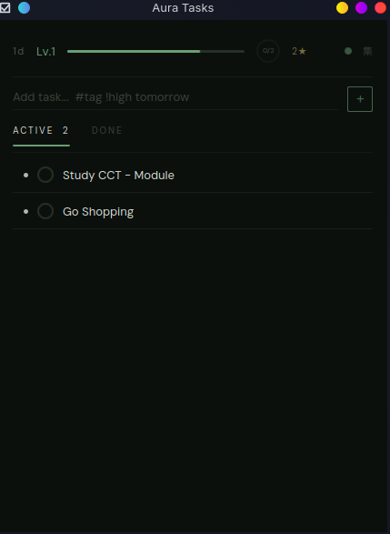
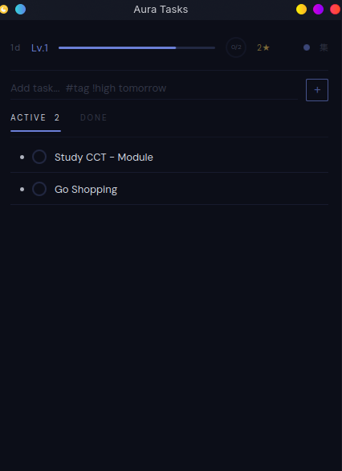
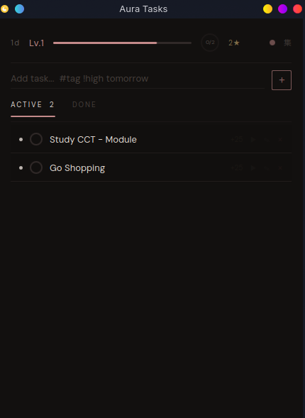
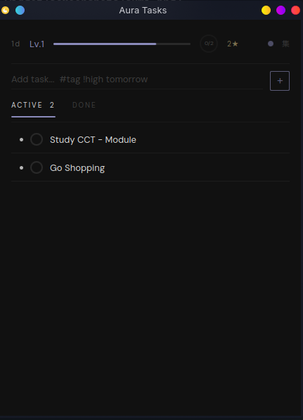
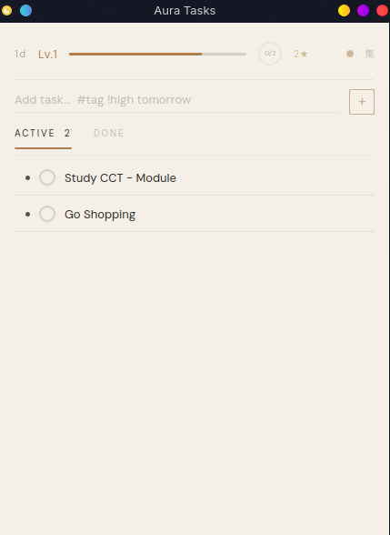

# Aura Tasks

**A gamified to-do app with zen aesthetics — for your desktop, on every OS.**

Earn XP, level up, keep streaks, unlock badges, and stay focused with a built-in
Pomodoro timer. Cross-platform desktop app built with Tauri (Rust + React).

## Download

Grab the latest installer for your OS from the
**[Releases page](https://github.com/ghostface-bz/aura-tasks-desktop/releases/latest)**:

| OS | File |
|----|------|
| **Windows** | `Aura.Tasks_x.y.z_x64-setup.exe` (or `.msi`) |
| **macOS** | `Aura.Tasks_x.y.z_universal.dmg` |
| **Linux** | `.AppImage` (portable), `.deb` (Debian/Ubuntu), `.rpm` (Fedora) |

> **Windows note:** the installer isn't code-signed yet, so SmartScreen will show
> *"Windows protected your PC."* Click **More info → Run anyway**. (Code signing is
> on the roadmap.)

## Features

- **Gamification** — Earn 10–100 XP per task by priority. Climb 10 ranks from
  Novice to Singularity. Build daily streaks and unlock 8 badges.
- **Pomodoro Timer** — Built-in 25/5/15 cycle (4 sessions), per-task or in Focus
  Shield mode, with desktop notifications on every phase change.
- **Focus Shield** — Single-task zen mode with a breathing pulse, skip/next, and a
  distraction-free layout.
- **Natural Language Input** — Type `Buy groceries #shopping !high tomorrow` and it
  auto-extracts the tag, priority, and due date.
- **Recurring Tasks** — `daily` / `weekly` tasks respawn on completion.
- **Undo Completion** — Checked something off by accident? Undo it from the Done tab.
- **6 Themes** — Hand-tuned palettes, switchable with one click.

## Themes

Click the colored dot in the header to cycle themes. Every UI element uses shared
color tokens, so each theme stays consistent throughout.

| | | |
|:---:|:---:|:---:|
|  |  |  |
| **Sumi** 墨 — ink (default) | **Kon** 紺 — deep indigo | **Sakura** 桜 — cherry blossom |
|  |  |  |
| **Ishi** 石 — stone | **Washi** 和紙 — paper (light) | **Focus Shield** — zen mode |

## Input Syntax

| Syntax | Example | Effect |
|--------|---------|--------|
| `#tag` | `Fix bug #work #urgent` | Adds tags |
| `!low` `!high` `!urgent` | `Clean desk !low` | Sets priority |
| `today` / `tomorrow` / `next week` | `Call dentist tomorrow` | Sets due date |
| `daily` / `weekly` | `Standup daily` | Recurring task |

## XP & Levels

| Priority | XP | | Level | Threshold | Name |
|----------|----|----|-------|-----------|------|
| Low | 10 | | 1–3 | 0 / 100 / 300 | Novice · Apprentice · Adept |
| Normal | 25 | | 4–6 | 600 / 1,000 / 1,500 | Expert · Master · Grandmaster |
| High | 50 | | 7–9 | 2,100 / 2,800 / 3,600 | Astral · Nebula · Cosmic |
| Urgent | 100 | | 10 | 4,500 | Singularity |

## Tech

- **Backend** — Rust ([Tauri v2](https://tauri.app)), SQLite via `rusqlite` (bundled,
  no system dependency). Data lives in your OS app-data dir.
- **Frontend** — React 19 + TypeScript + Vite, rendered through the OS's native
  webview (WebView2 / WebKit). No Electron — installers are ~2–3 MB.

Building from source? See **[BUILDING.md](BUILDING.md)**.

## License

GPL-2.0-or-later · Font: [DM Sans](https://fonts.google.com/specimen/DM+Sans) (SIL OFL 1.1)
</content>
